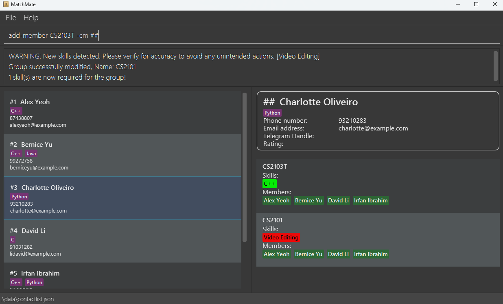
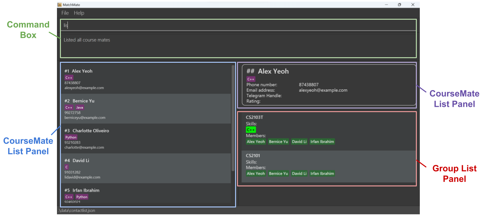

# MatchMate User Guide

MatchMate is a **desktop app for Computer Science students in NUS to create groups among their friends / acquaintances,
as well as to allow students to find balanced groups with diverse skill sets out of their own contact list.** 
It is optimized for Command Line Interface (CLI) while still having the benefits of a Graphical User Interface (GUI). 

This User Guide assumes that you have zero knowledge of our app and does not require any programming knowledge. However,
familiarity with keyboard shortcuts will significantly improve your experience with Matchmate.

<!-- * Table of Contents -->
<page-nav-print />

--------------------------------------------------------------------------------------------------------------------

## Navigating the User Guide
This user guide serves as an introductory guide to our app, MatchMate. Through this user guide, we hope to introduce
to users what features are available, the format for each command, as well as to give instructions to aid users when a command
is invalid or fails.

Ready to connect with other like-minded students and create the best group possible? Then jump right in with our list of features:

**CourseMate Management**
- **[Add a courseMate](#adding-a-coursemate-add)**: Met a new friend? Add them to your contact list with `add`.
- **[Edit a courseMate](#editing-a-coursemate-edit)**: Wrongly inputted some details? No worries! Edit your course mate's information using  `edit`.
- **[Add skills to a courseMate](#add-a-skill-to-a-coursemate-add-skill)**: Does your friend have notable skills that you want to take note of? If so, then you can use `add-skill`.
- **[Delete skills from a courseMate](#delete-a-skill-from-a-coursemate-delete-skill)**: Mistyped the skill name? Delete the skill by using `delete-skill`.
- **[Finding courseMates](#search-coursemates-with-keywords-find-mate)**: Looking for someone specific? The `find-mate` command does exactly that!
- **[Rate courseMate](#give-rating-to-your-coursemates-rate-mate)**: Had a good/bad experience with your course mates? `rate-mate` helps you to keep track of those experiences!
- **[List all courseMates](#listing-all-coursemates-and-groups-list)**: Shows all course mates and groups with `list`.
- **[Delete a courseMate](#deleting-a-coursemate-delete)**: Burnt a bridge with someone? You can always remove them from your list with `delete`.

**Group Management**
- **[Create a group](#create-group-project-create-group)**: Create a group for your upcoming project with `create-group`.
- **[Add members to your group](#add-coursemates-to-group-add-member)**: Easily add your friends to the group project using `add-member`.
- **[Delete members from your group](#delete-coursemates-from-group-delete-member)**: Changed your mind on some group members? `delete-member` has you covered!
- **[Add/edit a telegram URL to your group](#edit-the-telegram-chat-url-of-a-group-edit-tg-chat-url)**: Bring over the discussion to telegram by adding a telegram group url using `edit-tg-chat-url`.
- **[Require skills](#require-skills-in-a-group-require-skill)**: Require some specific skill sets for your group project? Add those requirements using `require-skill`.
- **[Unrequire skills](#unrequire-skills-in-a-group-unrequire-skill)**: Had second thoughts on the required skills? Easily delete them with `unrequire-sklill`.
- **[Mark important skills](#mark-important-skills-in-a-group-mark-important)**: Often times some skills are more needed than others. Mark these important skills with `mark-important`.
- **[Unmark important skills](#unmark-important-skills-in-a-group-unmark-important)**: Made a mistake in marking what's important? `unmark-important` reverses that.
- **[Suggest mate](#suggest-coursemates-for-group-suggest-mate)**: Not sure which course mate to add into your group? `suggest-mate` helps you find course mates that fulfills the group's required skills.
- **[Finding groups](#search-groups-with-keywords-find-group)**: Looking for a specific group? The `find-group` command does exactly that!
- **[Delete a group](#delete-a-group-delete-group)**: Finally done with your project? Say goodbye to your group project and remove it with `delete-group`.

Forgot about the features and formats for each command? Head over to the [Command Summary](#command-summary) for a quick overview.

--------------------------------------------------------------------------------------------------------------------

## Glossary
There may be some unfamiliar terms and tech jargon sprinkled within our user guide. As such, this segment aims to simplify those terms
to improve your experience with MatchMate.

| Terms                        | Meaning                                                                                                                                                                           |
|------------------------------|-----------------------------------------------------------------------------------------------------------------------------------------------------------------------------------|
| **ASCII**                    | Stands for American Standard Code for Information Interchange. It assigns standard numeric values to letters, numerals, punctuation marks, and other characters used in computers |
| **Command**                  | A user input that will cause the application to perform an operation according to the MatchMate UserGuide                                                                         |
| **Command History**          | A record that keeps track of commands that has been executed                                                                                                                      |
| **Command Line Interface**   | A text-based interface where you can input commands                                                                                                                               |
| **CourseMate**               | A friend or classmate that you expect to form a group based on certain skills they might have                                                                                     | 
| **Graphical User Interface** | A digital interface in which a user interacts with graphical components such as icons, buttons, and menus                                                                         | 
| **Group**                    | A grouping/team of courseMates for a course, project, or activity                                                                                                                 | 
| **JSON**                     | Stands for JavaScript Object Notation. It uses human-readable text to store and transmit data objects                                                                             |                                                          
| **Skill**                    | Knowledge, ability, or experience that a courseMate has                                                                                                                           |
| **Substring**                | A contiguous sequence of characters within a word.                                                                                                                                |
| **UI**                       | Stands for User Interface. It is the space where interactions between humans and the application occur                                                                            | 
| **URL**                      | Stands for Uniform Resource Locator. It is the address of a specific webpage or file (such as video, image, GIF, etc.) on the internet                                            |          

| Symbol                                               | Meaning of target text        |
|------------------------------------------------------|-------------------------------|
| <i class="fa-solid fa-lightbulb text-success"></i>   | Tip                           |
| <i class="fa-solid fa-info text-info"></i>           | Additional useful information |

--------------------------------------------------------------------------------------------------------------------

## Quick start

1. Ensure you have Java 11 or above installed in your Computer.
   <box type="info" seamless>

   First check if you have Java 11 by opening your terminal, and typing in `java -version`. If the command fails, that means that
   you have not downloaded Java yet. If you do not have Java 11 installed yet, then you can download it from [here](https://www.oracle.com/sg/java/technologies/downloads/).
   
   </box>

1. Download the latest `matchmate.jar` from [here](https://github.com/AY2324S2-CS2103T-F13-3/tp/releases/latest).

1. Copy the file to the folder you want to use as the _home folder_ for your app.

1. Select "Open in Terminal" in the folder you put the jar file in, and use the `java -jar matchmate.jar` command to run the application. 
   A GUI similar to the below should appear in a few seconds. Note how the app contains some sample data. 
   

1. Type the command in the command box and press <kbd>Enter</kbd> to execute it. e.g. typing **`help`** and pressing <kbd>Enter</kbd> will open the help window. 
   Some example commands you can try, these commands simulate the user flow of adding contacts, creating a group that require skills, and finding members for said group:

   * `list` : Lists all courseMates.
   
   * `add John Doe -p 87654321 -e johndoe@example.com -s Leadership -s C++`: Adds a courseMate named `John Doe` to the courseMate list.

   * `delete #3` : Deletes the 3rd courseMate shown in the current list.
   
   * `create-group CS Group -cm John Doe -s C++ -s Java` : Creates a group containing John Doe, this group also requires the skill C++.
   
   * `suggest-mate CS Group`: Suggests a possible courseMate whose skills match some unfulfilled skills in the group `CS Group`.

   * `exit` : Exits the app.

1. Refer to the [Features](#navigating-the-user-guide) above for details of each command.

--------------------------------------------------------------------------------------------------------------------

## User Interface

The UI consists of four main components:

1. **Command Box**: You can type your commands here and press <kbd>Enter</kbd> to execute them. You can also use the <kbd>:fas-caret-up:</kbd> and <kbd>:fas-caret-down:</kbd> arrow keys to navigate through your command history.
    <box type="info" seamless>

    **Note:** The <kbd>:fas-caret-up:</kbd> key will retrieve the previous command in the command history. When there is no previous command, it will cycle back to the most recent command. The <kbd>:fas-caret-down:</kbd> key will retrieve the next command. However, it will not cycle if you have reached the most recent command.

    This behavior is similar to the command history in a typical terminal.

    </box>
2. **CourseMate List Panel**: Displays the list of courseMates. Press <kbd>Enter</kbd> or double click to select a courseMate from the courseMate list panel.
3. **CourseMate Detail Panel**: Displays the details of a selected courseMate.
4. **Group List Panel**: Displays the list of groups.

You can use the <kbd>Tab</kbd> key to switch between the command box and the courseMate list panel.

<box type="tip" seamless>

Example If you want to add a few selected courseMates to a group, you can:
1. Select the first courseMate in the courseMate list panel and press <kbd>Enter</kbd>. The courseMate will be displayed in the courseMate detail panel.
2. Type `add-member GROUP_NAME -cm ##` in the command box and press <kbd>Enter</kbd>.
3. Press <kbd>Tab</kbd> to switch to the courseMate list panel. Select the next courseMate and press <kbd>Enter</kbd>.
4. Press <kbd>Tab</kbd> to switch back to the command box and press <kbd>:fas-caret-up:</kbd> to retrieve the previous command. Press <kbd>Enter</kbd> to execute the command.
5. Repeat steps 3 and 4 for the remaining courseMates.

This way, you can quickly add multiple courseMates to a group without having to type the courseMate names each time.

</box>

--------------------------------------------------------------------------------------------------------------------

## Commands: General

<box type="info" seamless>

**Notes about the command format:** 

* Words in `UPPER_CASE` are the parameters to be supplied by the user. 
  e.g. in `add NAME`, `NAME` is a parameter which can be used as `add John Doe`.

* Items in square brackets are optional. 
  e.g. `add NAME [-p PHONE_NUMBER]` can be used as `add John Doe -p 8762318` or as `add John Doe`.

* Items with `...`​ after them can be used multiple times including zero times. 
  e.g. `[-s SKILL]...​` can be used as ` ` (i.e. 0 times), `-s C++`, `-s C++ -s Python` etc.

* Extraneous parameters for commands that do not take in parameters (such as `help`, `list` and `exit`) will be ignored. 
  e.g. if the command specifies `help 123`, it will be interpreted as `help`.
</box>

### Viewing help : `help`

Shows a message that explains how to access the help page.

Format: `help`

### Listing all courseMates and groups: `list`

Lists all courseMates and groups in the lists.

Format: `list`

Expected output:
- `Message: Listed all courseMates and groups`

### Exiting the program : `exit`

Exits the program.

Format: `exit`

## Commands: CourseMate Management

### Adding a courseMate: `add`

Adds a courseMate to the courseMate list. A name and an email will be required, and all other information will be optional.

Format: `add NAME -e EMAIL [-p PHONE_NUMBER] [-t TELEGRAM_HANDLE] [-s SKILL]...​`

Parameters:
- `NAME`: Name of the courseMate. The string must only contain alphanumeric characters and spaces. Pick a nickname if the name is not fully alphanumeric.
- `EMAIL`: Email of the courseMate. Refer to the notes below for the acceptable format.
- `PHONE_NUMBER` (optional): Phone number of the courseMate. Accept strings with numeric characters only.
- `TELEGRAM_HANDLE` (optional): Telegram handle of the courseMate. Accept strings formed by alphanumeric characters and underscores only, and its length must be between 5 and 32 characters.
- `SKILL` (zero or multiple allowed): Skill(s) of the courseMate. Accepts any strings, except that words cannot start with the hyphen (-) character. 

<box type="tip" seamless>

**Tip:** A courseMate's name is case-insensitive. Adding a new courseMate with the same string but different capitalization will be rejected.
Consider adding a suffix to the name to differentiate them.

</box>

<box type="tip" seamless>

**Tip:** A courseMate can have any number of skills (including 0). Skill names are also case-insensitive.
</box>

Examples:

- `add John Doe -e e1234567@u.nus.edu`
- `add John Doe -e johndoe@example.com -p 87654321 -t johndoe -s Leadership -s C++`

<box type="info" seamless>

**Notes about Email format:** 

Emails should be of the format `local-part@domain` and adhere to the following constraints:

1. The local-part should only contain alphanumeric characters and the special characters `+`, `_`, `.` and `-`.
   The local-part may not start or end with any special characters.
2. This is followed by a `@` and then a domain name. The domain name is made up of domain labels separated by periods.
   The domain name must:
    - end with a domain label at least 2 characters long;
    - have each domain label start and end with alphanumeric characters;
    - have each domain label consist of alphanumeric characters, separated only by hyphens, if any.
</box>

### Editing a courseMate : `edit`

Edits an existing courseMate with a given name. This command supports changing the name, email, phone number and telegram handle.

Format: `edit COURSEMATE [-n NEW_NAME] [-e NEW_EMAIL] [-p NEW_PHONE_NUMBER] [-t NEW_TELEGRAM_HANDLE]` **(at least one field to edit must be supplied)**

Parameters:
- `COURSEMATE`: Name of the existing courseMate or aliases (substrings or in hashtag (#) notation).
- `NEW_NAME` (optional): New name of the courseMate.  The string must only contain alphanumeric characters and spaces. Pick a nickname if the name is not fully alphanumeric.
- `NEW_EMAIL` (optional): New email of the courseMate. Refer to the notes above for the acceptable format.
- `NEW_PHONE_NUMBER` (optional): New phone number of the courseMate. Accept strings with numeric characters only.
- `NEW_TELEGRAM_HANDLE` (optional): New Telegram handle of the courseMate. Accept strings formed by alphanumeric characters and underscores only, and its length must be between 5 and 32 characters.
- **At least one field to edit must be supplied.**
    
<box type="tip" seamless>

**Tip:**

Instead of supplying a full name to identify an existing courseMate, you can use the following shortcuts:
- `#1`, `#2`, ..., `#n` (where n is the number of courseMates currently displayed in the courseMate list panel) – `#k` references the k-th courseMate currently displayed in the courseMate list panel.

- `##` – References the courseMate currently displayed in the detailed view panel.

- A substring of the name instead of the full name.
    - In the event of multiple matches (the substring appears in multiple courseMates), you will receive the following message: `There are ? course mates with name containing ???. You can retry by giving the course mate's complete name or use the index of the contact.` and the list of matching courseMates will be displayed in the courseMate list panel.
    - No side effects will be made by the current command.
    - You should retry the command by finding the courseMate on the list and using the hashtag notation (`#`) to identify the courseMate.
    

  Example
    - You have the following courseMates listed in the courseMate list panel:  
      `#1 Benson`  
      `#2 Ben`  
      Typing `edit Ben` will display a warning message for having multiple matches.
    - Case 1: If you want to edit Benson:
        - Type  `edit Benson ...` or just its substring `edit Bens ...`.
        - Alternatively, you can use the alias `edit #1 ...`.
    - Case 2: If you want to edit Ben:
        - Type `edit #2 ...` as you must specify its index in the list.
</box>

Examples:
- `edit John Doe -n Joe Schmo`
- `edit #1 -n Joe Schmo`
- `edit John -e johndoe@gmail.com -p 98765432`

### Add skills to a courseMate : `add-skill`
Adds a list of skills to a courseMate. Adding a skill that already exists in the courseMate
will still succeed, but it won't show duplicate skills.

Format: `add-skill COURSEMATE -s SKILL [-s SKILL]...`

Parameters:
- `COURSEMATE`: Name of the existing courseMate. Accept aliases (substrings or in hashtag (#) notation).
- `SKILL` (one or multiple allowed): Skill(s) of the courseMate. Accepts any strings containing ASCII characters (characters with ASCII value from 0-127), except that words cannot start with the hyphen (-) character. 

Examples:
- `add-skill John Doe -s C++ -s Leadership`

  
### Delete skills from a courseMate  : `delete-skill`
Deletes a list of skills from a courseMate.

Format: `delete-skill COURSEMATE -s SKILL [-s SKILL]...`

Parameters:
- `COURSEMATE`: Name of the existing courseMate. Accept aliases (substrings or in hashtag (#) notation).
- `SKILL`: (one or multiple allowed): Skill(s) of the courseMate. These must be existing skills that the courseMate contains.

Examples:
- `delete-skill John Doe -s C++ -s Leadership`

### Finding courseMates with keywords: `find-mate`

Finds all courseMates whose names or skills contain the specified keyphrase (case-insensitive).

To match a courseMate’s skill, the keywords should match exactly with the skill. To match a courseMate’s name, the keywords can be a case-insensitive substring of the name.

Format: `find-mate KEYPHRASE`

Parameters:
- `KEYPHRASE`: Combination of keywords to be used for the search. Accepts any strings including spaces.

Examples:
- `find-mate John`
- `find-mate C++`

### Deleting a courseMate : `delete`

Deletes a courseMate with a given name.

Format: `delete COURSEMATE`

Parameters:
- `COURSEMATE`: Name of the existing courseMate. Accept aliases (substrings or in hashtag (#) notation).

Examples:
- `delete ##`
- `delete John`

### Rate a courseMate: `rate-mate`

Rates a courseMate by up to five stars.

Format: `rate-mate COURSEMATE -r RATING`

Parameters:
- `COURSEMATE`: Name of the existing courseMate to give the rating to. Accept aliases (substrings or in hashtag (#) notation).
- `RATING`: The rating given, which is a single digit integer between 0 and 5, where 0 signifies that no rating is given.

Examples:
- `rate-mate Bob -r 5`

## Commands: Group Management

### Create group project: `create-group`

Creates a group project. You can specify the courseMates in the group when creating the group, or choose to add them later.

Format: `create-group GROUP_NAME [-t TELEGRAM_CHAT_URL] [-cm COURSEMATE]... [-s SKILL]...`

Parameters:
- `GROUP_NAME`: The group name. The string must only contain alphanumeric characters and spaces. Pick a nickname if the name is not fully alphanumeric.
- `TELEGRAM_CHAT_URL` (optional): The URL of the Telegram chat for the group. Accept strings that start with `https://t.me/` and followed by alphanumeric characters and the special characters `+`, `-` and `_`.
- `COURSEMATE` (zero or multiple allowed): Name of the existing courseMates to be added to the group. Accept aliases (substrings or in hashtag (#) notation).
- `SKILL` (zero or multiple allowed): Required skill(s) of the group. Accepts any strings, except that words cannot start with the hyphen (-) character.

Examples:
- `create-group CS2103T G18`
- `create-group CS2103T G18 -t https://t.me/+WDTg34uuUlH8Ml2d`
- `create-group CS2103T G18 -cm John -cm #2 -s C++ -s Java`
- `create-group CS2103T G18 -cm John -s C++ -s Java -cm #2 -t https://t.me/+WDTg34uuUlH8Ml2d`

### Add courseMates to group: `add-member`
Adds some team members to an existing group.

Format: `add-member GROUP_NAME -cm COURSEMATE [-cm COURSEMATE]...`

Parameters:
- `GROUP_NAME`: Name of the existing group.
- `COURSEMATE` (one or multiple allowed): Name of the existing courseMates to be added to the group. Accept aliases (substrings or in hashtag (#) notation).

Examples:
- `add-member CS2103T G18 -cm Ivan -cm #1`
- `add-member CS2103T G18 -cm ##`

<box type="tip" seamless>

**Tip:** Different from courseMate names, group names must be an exact match.
</box>

### Delete courseMates from group: `delete-member`

Deletes some team members from an existing group.

Format: `delete-member GROUP_NAME -cm COURSEMATE [-cm COURSEMATE]...`

Parameters:
- `GROUP_NAME`: Name of the existing group.
- `COURSEMATE` (one or multiple allowed): Name of the existing courseMates to be deleted from the group. Accept aliases (substrings or in hashtag (#) notation).

Examples:
- `delete-member CS2103T G18 -cm Ivan -cm #1`
- `delete-member CS2103T G18 -cm ##`

### Edit the telegram chat URL of a group: `edit-tg-chat-url`

Edits the telegram chat URL of a group.

Format: `edit-tg-chat-url GROUP_NAME -t NEW_TELEGRAM_CHAT_URL`

Parameters:
- `GROUP_NAME`: Name of the existing group.
- `NEW_TELEGRAM_CHAT_URL`: New URL of the Telegram chat for the group. Accept strings that start with `https://t.me/` and followed by alphanumeric characters and the special characters `+`, `-` and `_`.

Examples:
- `edit-tg-chat-url CS2103T G18 -t https://t.me/+WDTg34uuUlH8Ml2d`

<box type="info" seamless>
<b>Note:</b> Supplying more than one telegram chat URL

Only the last supplied telegram chat URL will be considered when URLs are given
</box>

### Require skills in a group: `require-skill`

Add skills that should be required or necessary for the group. You only need one member that possesses the skill for it to be marked as fulfilled. Fulfilled skills are marked in green while unfulfilled ones are marked in red.

Format: `require-skill GROUP_NAME -s SKILL [-s SKILL]...`

Parameters:
- `GROUP_NAME`: Name of the existing group.
- `SKILL` (one or multiple allowed): Required skill(s) of the group. Accepts any strings, except that words cannot start with the hyphen (-) character.

Examples:
- `require-skill CS2103T G18 -s C++ -s Java`

### Unrequire skills in a group: `unrequire-skill`

Mark skills that are no longer required or necessary for the group.

Format: `unrequire-skill GROUP_NAME -s SKILL [-s SKILL]...`

Parameters:
- `GROUP_NAME`: Name of the existing group.
- `SKILL` (one or multiple allowed): Skill(s) to be marked as no longer required in the group. Accepts any strings, except that words cannot start with the hyphen (-) character.

Examples:
- `unrequire-skill CS2103T G18 -s C++ -s Java`

### Mark important skills in a group: `mark-important`

Mark skills that are considered as important in the group. Important skills are signified with a [!] notation.

Format: `mark-important GROUP_NAME -s SKILL [-s SKILL]...`

Parameters:
- `GROUP_NAME`: Name of the existing group.
- `SKILL` (one or multiple allowed): Skill(s) to be marked as no longer required in the group. Accepts any strings, except that words cannot start with the hyphen (-) character.

Examples:
- `mark-important CS2103T G18 -s C++ -s Java`
- 
### Unmark important skills in a group: `unmark-important`

Mark skills that are no longer considered as important in the group. 

Format: `unmark-important GROUP_NAME -s SKILL [-s SKILL]...`

Parameters:
- `GROUP_NAME`: Name of the existing group.
- `SKILL` (one or multiple allowed): Skill(s) to be marked as no longer required in the group. Accepts any strings, except that words cannot start with the hyphen (-) character.

Examples:
- `unmark-important CS2103T G18 -s C++ -s Java`

### Suggest courseMates for group: `suggest-mate`

Searches courseMates that has any of the required skills from the group that is not fulfilled yet. CourseMates already in the group will not be listed.

Format: `suggest-mate GROUP_NAME`

Parameters:
- `GROUP_NAME`: Name of the existing group.

Examples:
- `suggest-mate CS2103T G18`

### Search groups with keywords: `find-group`

Search groups that include all matching keywords in their name.

To match a group's name, the keywords can be a case-insensitive substring of the name.

Format: `find-group KEYPHRASE`

Parameters:
- `KEYPHRASE`: Combination of keywords to be used for the search. Accepts any strings including spaces.

Examples:
- `find-group CS2103T G18`

### Delete a group: `delete-group`
Deletes a group.

Format: `delete-group GROUP_NAME`

Example: `delete-group CS2103T G18`

Parameters:
- `GROUP_NAME`: Name of the existing group.

## Other Features

### Save and load the state of app

Load the saved data when starting the app. Save the state of courseMates and groups every time it is updated via adding or editing. This should run automatically on start and subsequently after a command that alters the state of the app (e.g. add, edit).

### Editing the data file

MatchMate data are saved automatically as JSON files in `[JAR file location]/data/`. It is possible but not recommended to edit the different `.json` files directly instead of through the app.

<box type="warning" seamless>

**Caution:**
It is recommended to take a backup of the original save file before editing it. 
Certain edits can cause the MatchMate to behave in unexpected ways (e.g., if a value entered is outside the acceptable range). Therefore, edit the data file only if you are confident that you can update it correctly.
</box>

--------------------------------------------------------------------------------------------------------------------

## Troubleshooting

**Q**: I encountered the error message `Invalid command format!` when I tried to execute a command. What should I do? 
**A**: You are likely to have missed out on a required parameter for the command. Refer to the [Command Summary](#command-summary) for the correct format of the command.
Note that parameters in square brackets are optional, while those without square brackets are required.

**Q**: I encountered the error message `Some of the specified members could not be found.` when I tried to add a member to a group. What should I do? 
**A**: If you used the hashtag notation (`##` or `#n`) to refer to a courseMate, check if the courseMate is displayed in the panel. Retry the command with an existing hashtag. Otherwise, you may have misspelled the courseMate's name. You can use the `find-mate` command to search for the courseMate.

**Q**: I accidentally deleted a courseMate. Can I undo the deletion? 
**A**: Unfortunately, the deletion of a courseMate is irreversible. You will need to re-add the courseMate to the list.

--------------------------------------------------------------------------------------------------------------------

## FAQ

**Q**: How do I transfer my data to another Computer? 
**A**: Install the app in the other computer and overwrite the empty data file it creates with the file that contains the data of your previous MatchMate home folder.

**Q**: Do I need internet connection to run MatchMate? 
**A**: MatchMate is an offline application that does not require any internet connection.

**Q**: How do I save the changes that I have made? 
**A**: All your data is automatically saved, so there's no need to manually save it.

--------------------------------------------------------------------------------------------------------------------

## Known issues

1. **When using multiple screens**, if you move the application to a secondary screen, and later switch to using only the primary screen, the GUI will open off-screen. The remedy is to delete the `preferences.json` file created by the application before running the application again.

--------------------------------------------------------------------------------------------------------------------

## Command summary

Action     | Format, Examples
-----------|----------------------------------------------------------------------------------------------------------------------------------------------------------------------
**Add a courseMate**    | `add NAME -e EMAIL [-p PHONE_NUMBER] [-t TELEGRAM_HANDLE] [-s SKILL]...​`   e.g., `add John Doe -e johndoe@example.com -p 87654321 -t johndoe -s Leadership -s C++`
**Add group members**    |   `add-member GROUP_NAME -cm COURSEMATE [-cm COURSEMATE]...`   e.g., `add-member CS2103T G18 -cm Ivan -cm ##`
**Add skills**   |   ` add-skill COURSEMATE -s SKILL [-s SKILL]...`   e.g., `add-skill John Doe -s C++ -s Leadership`
**Create group**    |   `create-group GROUP_NAME [-t TELEGRAM_CHAT_URL] [-cm COURSEMATE]... [-s SKILL]...`   e.g., `create-group CS2103T G18 -cm John -s C++ -s Java -cm #2 -t https://t.me/+WDTg34uuUlH8Ml2d`
**Delete courseMate**  | `delete COURSEMATE`   e.g., `delete John`
**Delete group**    | `delete-group GROUP_NAME`   e.g., `delete-group CS2103T G18`
**Delete group members**    |   `delete-member GROUP_NAME -cm COURSEMATE [-cm COURSEMATE]...`   e.g., `delete-member CS2103T G18 -cm Ivan -cm #1`
**Delete skills** | `delete-skill COURSEMATE -s SKILL [-s SKILL]...`   e.g., `delete-skill John Doe -s C++ -s Leadership `
**Edit courseMate**   | `edit COURSEMATE [-n NEW_NAME] [-e NEW_EMAIL] [-p NEW_PHONE_NUMBER] [-t NEW_TELEGRAM_HANDLE]​` **(at least one field to edit must be supplied)**  e.g.,`edit John -p 98765432 -e johndoe@gmail.com -t johndoe1234`
**Edit group telegram chat URL**    | `edit-tg-chat-url GROUP_NAME -t NEW_TELEGRAM_CHAT_URL`   e.g., `edit-tg-chat-url CS2103T G18 -t https://t.me/+WDTg34uuUlH8Ml2d`
**Find courseMate**   | `find-mate KEYPHRASE`  e.g., `find John`
**Find group**   | `find-group KEYPHRASE`  e.g., `find CS2103T`
**Help**   | `help`
**List**   | `list`
**Mark skills as important in group**   | `mark-important GROUP_NAME -s SKILL [-s SKILL]...`   e.g., `mark-important CS2103T G18 -s C++ -s Java`
**Require skills in group**    | `require-skill GROUP_NAME -s SKILL [-s SKILL]...`   e.g., `require-skill CS2103T G18 -s C++ -s Java`
**Suggest courseMates for group** | `suggest-mate GROUP_NAME`   e.g., `suggest-mate CS2103T G18`
**Unmark skills as important in group**   | `unmark-important GROUP_NAME -s SKILL [-s SKILL]...`   e.g., `unmark-important CS2103T G18 -s C++ -s Java`
**Unrequire skills in group**    | `unrequire-skill GROUP_NAME -s SKILL [-s SKILL]...`   e.g., `unrequire-skill CS2103T G18 -s C++ -s Java`
